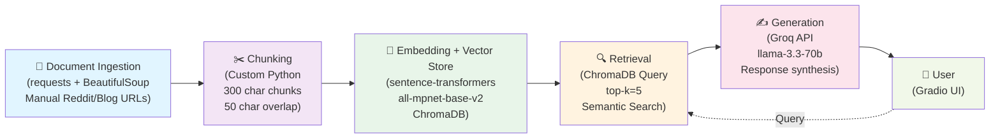

# Project 1 Planning: The Unofficial Guide

> Write this document before you write any pipeline code.
> Your spec and architecture diagram are what you'll use to direct AI tools (Claude, Copilot, etc.) to generate your implementation — the more specific they are, the more useful the generated code will be.
> Update the Retrieval Approach and Chunking Strategy sections if you change your approach during implementation.
> Update this file before starting any stretch features.

---

## Domain

<!-- What domain did you choose? Why is this knowledge valuable and hard to find through official channels? -->
**Domain:** College Students' Attitudes Toward Organic Chemistry

**Domain Summary:**

This guide consolidates authentic student experiences and attitudes about organic chemistry from scattered Reddit threads, blogs, and forums into one resource. Student perspectives on why the course is difficult, how to succeed, and what to realistically expect are currently hard for incoming students to find, making this peer-to-peer knowledge valuable and otherwise inaccessible.

---

## Documents

<!-- List your specific sources: URLs, subreddit names, forum threads, or file descriptions.
     Aim for at least 10 sources that together cover different subtopics or perspectives within your domain. -->

| # | Title | Source | URL/Path | Description |
|---|-------|-------------|---------|-------------|
| 1 | In your experience, why do undergraduate students find organic chemistry a very hard subject? | Reddit | https://www.reddit.com/r/OrganicChemistry/comments/1thnyk4/in_your_experience_why_do_undergraduate_students/ | Students, instructors, and chemists discuss why organic chemistry is difficult, highlighting issues such as memorization, spatial reasoning, and ineffective teaching methods |
| 2 | Is organic chemistry that hard? | Reddit | https://www.reddit.com/r/ChemicalEngineering/comments/1lz3h9s | Students share whether organic chemistry deserves its reputation as one of the hardest college courses and compare it with other engineering classes |
| 3 | Hardest Chemistry Subjects for Chemistry Grads | Reddit | https://www.reddit.com/r/chemistry/comments/1smu4rj/hardest_chemistry_subjects_for_chemistry_grads/ | Chemistry students and graduates debate whether organic chemistry is the hardest subject in chemistry and compare it with physical and quantum chemistry |
| 4 | SOS: Organic Chemistry! | University of Illinois Student Ambassador Blog | https://scs.illinois.edu/student-ambassadors-blog/sos-organic-chemistry-0 | A student blogger discusses common struggles in organic chemistry and explains why memorization alone is not enough for success |
| 5 | Is Organic Chemistry Really That Hard? | Vanderbilt University Student Blog | https://admissions.vanderbilt.edu/insidedores/2021/02/is-organic-chemistry-really-that-hard/ | A Vanderbilt student reflects on fears surrounding organic chemistry and explains how expectations differed from the actual course experience |
| 6 | Is Organic Chemistry Really the Hardest College Course? | Nova Scholar | https://www.novascholar.education/blog-posts/is-organic-chemistry-really-the-hardest-college-course | Reviews why organic chemistry is viewed as a "weed-out" course and discusses the experiences of students with different learning styles |
| 7 | Is Organic Chemistry Hard? (Beginner Tips!) | WillPeachMD | https://willpeachmd.com/is-organic-chemistry-hard | A medical student and educator discusses failure rates, workload, and strategies students use to succeed in organic chemistry |
| 8 | Is Organic Chemistry Hard? Why Orgo Feels Brutal (and What You Can Do) | Blog article | https://finishmymathclass.com/is-organic-chemistry-hard/ | Compiles common student complaints about exams, labs, and pacing, with examples of students' experiences. |
| 9 | Is Organic Chemistry really one of the hardest college classes? | CollegeVine Forum | https://www.collegevine.com/faq/94111/is-organic-chemistry-really-one-of-the-hardest-college-classes | Students considering pre-med discuss the reputation of organic chemistry and receive advice from those who have completed the course |
| 10 | How hard is Organic Chemistry, really? | Reddit | https://www.reddit.com/r/premed/comments/5hca0e/how_hard_is_organic_chemistry_really/ | Pre-med students share their experiences with organic chemistry, discussing workload, study habits, and the balance between memorization and conceptual understanding |

---
## Source Collection Notes

- **Collection Date:** 7th June 2026
- **Total Sources:** 10
- **Coverage:** Student perceptions of difficulty, reasons why organic chemistry is hard (memorization, spatial reasoning, teaching methods), comparison with other courses, student fears and expectations vs. reality, learning strategies, study habits, lab and exam experiences, the "weed-out" course reputation, diverse learning styles, workload and time management, pre-med student perspectives

---
## Chunking Strategy

<!-- How will you split documents into chunks?
     State your chunk size (in tokens or characters), overlap size, and explain why those
     numbers fit the structure of your documents.
     A review-heavy corpus warrants different chunking than a long FAQ. -->

**Chunk size:** 
300 characters

**Overlap:** 
50 characters

**Reasoning:**
Reddit comments and blog paragraphs naturally fit this range. Large enough to capture a complete thought, small enough that one chunk = one student voice. Low overlap — unlike technical docs, student opinions don't need repetition at boundaries. Overlap just prevents semantic breaks.

---

## Retrieval Approach

<!-- Which embedding model are you using (e.g., all-MiniLM-L6-v2 via sentence-transformers)?
     How many chunks will you retrieve per query (top-k)?
     If you were deploying this for real users and cost wasn't a constraint, what tradeoffs
     would you weigh in choosing a different embedding model — context length, multilingual
     support, accuracy on domain-specific text, latency? -->

**Embedding model:** 
all-MiniLM-L6-v2 (via sentence-transformers), 384-dim. Fast, lightweight (~80MB), and strong on short English text. My chunks average ~270 characters — well under its 256-token window — so its shorter context length isn't a limitation for this corpus.

**Top-k:** 
5 chunks. Student opinion/experience domains benefit from multiple diverse perspectives rather than one "best match." 5 chunks allows the generator to synthesize different viewpoints.

**Production tradeoff reflection:**
If cost weren't a constraint, I'd move to all-mpnet-base-v2 (768-dim) or a domain-specialized model fine-tuned on education forums + Reddit discussions. Tradeoffs: domain-specific accuracy ("hard," "struggle," "stressful" carry chemistry-specific meaning general models blur) and context length (for longer Reddit comments) vs. latency and serving cost. Multilingual support isn't needed for US college students. For short English opinions, MiniLM's speed/size win; for production I'd take mpnet's accuracy over the latency hit.

---

## Evaluation Plan

<!-- List your 5 test questions with their expected correct answers.
     Questions should be specific enough that you can judge whether the system's response
     is right or wrong. "What are good dining halls?" is too vague.
     "What do students say about wait times at [dining hall name] during lunch?" is testable. -->

| # | Question | Expected answer |
|---|----------|-----------------|
| 1 | What specific reasons do students mention for finding organic chemistry difficult? | Response mentions at least 3 of the following: difficulty visualizing/rotating 3D molecular structures, heavy memorization requirements, abstract concepts (mechanisms, electron movement), ineffective or fast-paced teaching, spatial reasoning challenges, or high workload relative to other courses. |
| 2 | What study strategies do successful students recommend to improve performance in organic chemistry? | Response mentions at least 2 specific tools/approaches: molecular model kits, practice problem sets, tutoring/finding better instructors, focusing on conceptual understanding over memorization, study groups, or 3D visualization software. Response should be actionable, not vague (e.g., "study more" doesn't count). |
| 3 | What specific examples do students give of their expectations not matching their actual experience in organic chemistry? | Response includes at least one concrete mismatch: e.g., "expected it to be purely memorization but found conceptual thinking was required," "thought they'd fail but succeeded with right instructor," "worried about workload but managed with proper strategies," or "feared it would be harder than general chemistry but found it manageable." |
| 4 | What emotional challenges do students specifically name when describing their organic chemistry experience? | Response mentions at least 2 of: test anxiety, frustration with problem-solving, fear of failure/failing out, stress from workload, imposter syndrome, or feeling discouraged by peers' struggles. Should cite emotional language, not just academic difficulty. |
| 5 | Based on student discussions, what specifically determines how hard organic chemistry feels: the course itself or the instructor? | Response should extract the student consensus: most agree that instructor quality/teaching method significantly impacts difficulty more than the course content alone. Should include specific examples (e.g., "same course, different professors, different outcomes") or direct quotes from students contrasting instructors. |

---

## Anticipated Challenges

<!-- What could go wrong? Name at least two specific risks with reasoning.
     Consider: noisy or inconsistent documents, missing source attribution, off-topic
     retrieval, chunks that split key information across boundaries. -->

1. **Conflicting or contradictory student advice** — Reddit and student blogs contain opposing viewpoints: some say "organic chemistry is all memorization," others say "memorization is useless, focus on mechanisms." Without explicit source attribution, users won't know if they're hearing from a struggling student or someone who succeeded. The system needs to present multiple perspectives transparently, not conflate them into one answer. *Mitigation:* Include source info in responses (e.g., "A pre-med student said..." vs "A chemistry major said...").

2. **Noisy chunks from Reddit threads** — Reddit threads are full of tangents, jokes, emotional venting ("This class made me want to quit"), and off-topic discussion. A 300-character chunk might capture a rant rather than actionable advice. Additionally, chunk boundaries might split narrative advice across multiple chunks (e.g., "I struggled because X. I tried Y. It worked.") losing the causal connection. *Mitigation:* Filter out obviously emotional/non-substantive chunks during post-processing; test chunking strategy on real Reddit threads to ensure key advice isn't fragmented.

3. **Off-topic retrieval on chemistry-adjacent queries** — A query like "Is chemistry hard?" or "Hardest college courses" could retrieve chunks about organic chemistry difficulty, general chemistry, physics, or calculus. Without strong domain boundaries, the system might return irrelevant comparisons. *Mitigation:* Explicitly test queries with semantic drift (general difficulty questions vs organic-chemistry-specific) and refine embedding model if needed.

---

## Architecture

<!-- Draw a diagram of your pipeline showing the five stages:
     Document Ingestion → Chunking → Embedding + Vector Store → Retrieval → Generation
     Label each stage with the tool or library you're using.
     You can use ASCII art, a Mermaid diagram, or embed a sketch as an image.
     You'll use this diagram as context when prompting AI tools to implement each stage. -->

**Pipeline Summary:**
1. **Ingestion:** Fetch HTML from Reddit threads, university blogs, forums using requests/BeautifulSoup
2. **Chunking:** Split documents into 300-character semantic chunks with 50-char overlap; preserve Reddit comment/blog paragraph boundaries
3. **Embedding:** Use sentence-transformers (all-mpnet-base-v2) to convert chunks to 768-dim vectors; store in ChromaDB with metadata (source, date)
4. **Retrieval:** On user query, embed query with same model; retrieve 5 most similar chunks using cosine similarity
5. **Generation:** Pass retrieved chunks + query to Groq LLM with system prompt for synthesis; return response via Gradio interface

---

## AI Tool Plan

<!-- For each part of the pipeline below, describe:
     - Which AI tool you plan to use (Claude, Copilot, ChatGPT, etc.)
     - What you'll give it as input (which sections of this planning.md, which requirements)
     - What you expect it to produce
     - How you'll verify the output matches your spec

     "I'll use AI to help me code" is not a plan.
     "I'll give Claude my Chunking Strategy section and ask it to implement chunk_text()
     with my specified chunk size and overlap" is a plan. -->

**Milestone 3 — Ingestion and chunking:**

**Tool:** GitHub Copilot

**Input:** 
- Chunking Strategy section (300 char chunks, 50 char overlap, semantic paragraph boundaries)
- Sample Reddit/blog URLs (3–5 real examples)
- Requirements: preserve Reddit comment structure, don't split student voices mid-thought

**Expected Output:** 
- `load_documents(urls)` function: fetches HTML from URLs, parses text, returns list of dicts with `{text, source, date}`
- `chunk_document(text, source)` function: splits into 300-char chunks with 50-char overlap, returns list of dicts with `{text, source_url, chunk_id}`

**Verification:**
- Test on 2 real Reddit threads; verify chunks are 280–320 characters (±10%)
- Manually inspect 5 chunks; confirm no student voices are fragmented mid-sentence
- Verify overlap: confirm last 50 chars of chunk N appear at start of chunk N+1

---

**Milestone 4 — Embedding and retrieval:**

**Tool:** Claude (for complex reasoning about vector stores)

**Input:**
- Retrieval Approach section (all-mpnet-base-v2, top-k=5, cosine similarity)
- Architecture diagram (ChromaDB stage)
- sentence-transformers + ChromaDB documentation links

**Expected Output:**
- `embed_and_store(chunks)` function: converts chunks to 768-dim vectors using all-mpnet-base-v2, stores in ChromaDB with metadata (source, date)
- `retrieve(query, k=5)` function: embeds user query, retrieves 5 most similar chunks by cosine distance, returns sorted by relevance

**Verification:**
- Embed 10 test chunks; verify output shape is (10, 768)
- Query "Why is organic chemistry hard?"; manually verify top-5 results are semantically relevant
- Test off-topic query ("How to cook pasta?"); confirm retrieval returns low-relevance chunks (high distance scores)

---

**Milestone 5 — Generation and interface:**

**Tool:** GitHub Copilot

**Input:**
- Architecture diagram (Generation stage)
- Evaluation Plan section (5 test questions + expected answers)
- Groq API documentation + system prompt for grounding

**Expected Output:**
- `generate_response(query, chunks)` function: formats chunks with source attribution, calls Groq LLM with system prompt, returns synthesized answer
- Gradio interface: text input for query, text output for response, example questions pre-loaded

**Verification:**
- Run 5 test questions from Evaluation Plan against live system
- Compare responses to expected answers: should mention ≥2–3 key points, cite perspectives accurately
- Manually verify system doesn't hallucinate information beyond retrieved chunks
